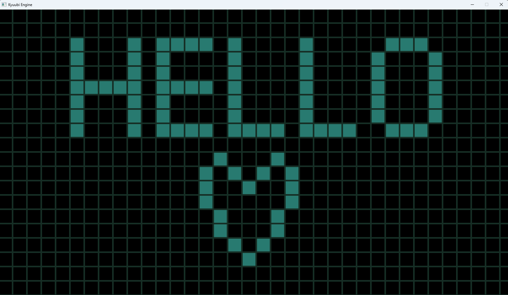

# Conways Game of Life
 
# Description
Small project to create conways game of life using SDL2.
<br>
First time doing something graphical in C++.
<br>

Window handling and architecture heavily inspired by the [Hazel Engine](https://github.com/TheCherno/Hazel) 

# Dependencies

- SLD2 via vcpkg or include it in the Visual Studio settings under
```Linker -> Input -> Additional Dependencies```

# Building
There is currently no build system so just open the included Visual Studio 2022 Solution!
<br>
(I know this is bad practice!)
